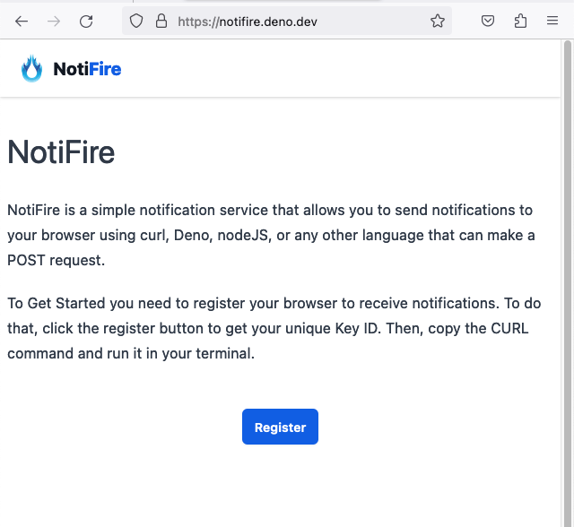
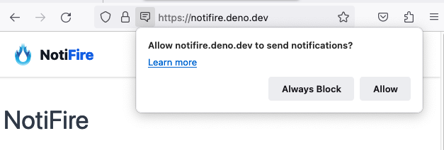
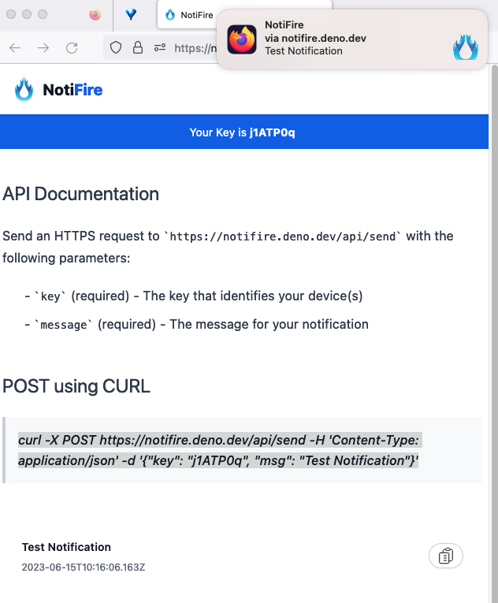

# NotiFire

This is a project hacked in a couple of days to participate in the [Deno KV Hackathon](https://deno.com/blog/deno-kv-hackathon).

The idea is to have a system to notify users of events in general. The first use case is to notify a user when a shell command is complete.
Since I'm into Data science, I want to be notified when a long running training job is complete.

### Screenshots
#### Initial Screen

#### Request for Notification

#### Notification
